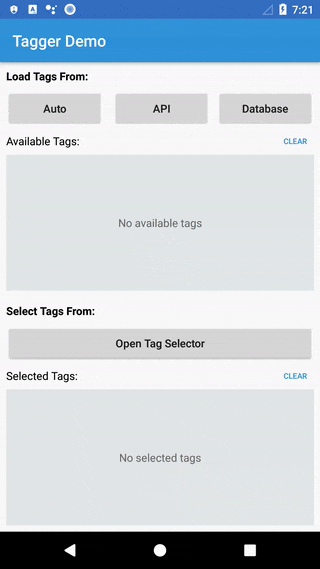
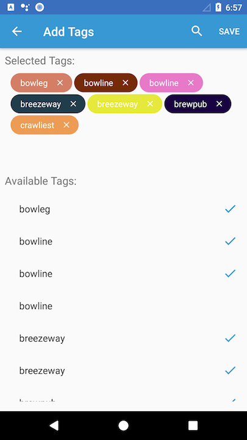

# Tagger Demo App

### Overview

A demo application for playing with the custom Tagger library. Tagger allows for plug-n-play tag selection.

The Tagger library includes the following features:

 - **Available Tags View**: A table displaying all tags available for selection or deselection. Selected tags will have a check mark displayed for that tag. Clicking a tag row will toggle tag selection on or off.  
	 - Available tags are displayed in alphabetical order.
 - **Selected Tags View**: A layout that uses [**FlowLayoutManager**][1] and custom tag chip views to display the list of selected tags. Selected tags can be "closed" (deselected), by clicking on the chip. 
	 - Tags are inserted and removed in alphabetical order. 
 - **Custom Tag Chips**:  A custom view that follows the Material Design guidelines for [**Chips**][2]. A chip is configured with the following data:
	 - Label - The label displayed on the tag.
	 - Color - The background color of the tag. 
 - A single Activity with a simple API that allows for passing in a list of available and selected tags. This Activity includes two layouts to make the most of screen real estate:
	 - Portrait mode
	 - Landscape mode
 - **Tag Filtering mode**: Filters available and selected tags as you type. Designed to survive orientation changes. 

### Considerations

 - **Minimum SDK**: I chose to set the minimum SDK to 16 to match the minimum SDK of the current Android App in the Google Play Store. 
 - **Duplicate tags**: Since each tag has an ID and color associated with it, I did not remove any tags with duplicate tag labels. If I were designing this to not allow duplicates, I would've set the tag label as the primary key in the database and used the database to dedupe the list before sending the results. 
 - **Tests**: Due to time constraints I did not write as many tests as I would've liked. I recently took on a full-time+ project that has been eating up most of my free time and I didn't want to hold up your hiring process. If you would like me to go back in and add some more tests please let me know. 
 - **Language**: I wrote this codelab in Java only because I'm still learning **Kotlin**. That other full-time project I've been working on is 100% Kotlin so I'm learning fast and getting my feet wet. If you would like me to convert this project to Kotlin, please let me know. 
 - **Background Processing**: I chose to use AsyncTask for background processing for simplicity. For larger apps I would've either used RxJava, or managed thread pools. 
 - **Tagger Library**: This is the custom Tag Selector library. It's only responsibility is to take a list of available tags and selected tags, display views for working with these lists, and returning the results. I chose not to add the data layer to this library so it could remain flexible. 

### Architecture

 - **Database**: Room + Sqlite
 - **Network**: Retrofit + LoganSquare
 - **MVP**: Used the MVP pattern for the main demo app. 
 - **Retrieving and caching data**: The current design will fetch a fresh set of tags from the network, save them to the database, and keep a cached copy for the remainder of the session. The only time the app will automatically retrieve tags from the database is if there is no network connection. Clicking **Auto** in the demo app will test this logic. If the app is not connected to the Internet, it will load from the database. 

### Demo App Instructions
The demo app is split into two sections. 

 - **Load Tags From**: This section tests the network, db, and caching logic and loads the **Available Tags** 
	 - **Auto**: Will use the main logic for fetching tags automatically. Tags will be fetched using the following logic:
		 - Memory Cache if available
		 - Network if connected
		 - Database
	 - **API**: Fetch tags from the remote repository.
	 - **Database**: Fetch tags from the database.
	 - **Clear**: Clear the current list of available tags. 
	 - **Available Tags List**: A simple list that displays all tags fetched. Note the left hand column is the row number. 
 - **Select Tags From**: Opens the custom Tag Selector. 
	 - Requires a list containing 1 or more available tags. 
	 - Accepts an optional list of selected tags for seeding the "selected" view. 
	 - **Clear**: Clears the selected tags. 
	 - **Selected Tags List**: A simple list that displays all the selected tags. Note the left hand column is the row number. 

### Building

1. Clone the git repository
2. Run `./gradlew build`	

# Screenshots 
**Demo App**

 
**Tag Selector View**

  [1]: https://github.com/xiaofeng-han/AndroidLibs/tree/master/flowlayoutmanager
  [2]: https://material.io/guidelines/components/chips.html
